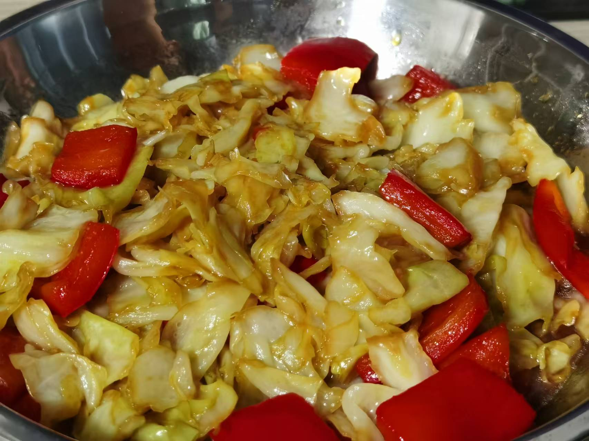
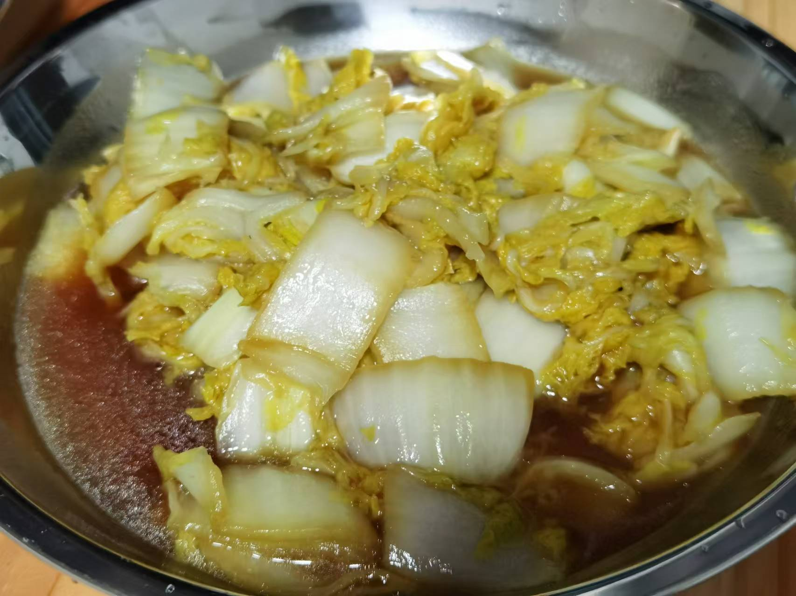

## 准备材料  
- 1个`包菜`  
- 1瓣`蒜`  
- 1根`小米辣`  
- 调料  
    - 2勺`生抽`  
    - 1勺`蚝油`   
    - 1勺`陈醋`  
    - 少许`盐`  
    - 少许`糖`  

***********

## 步骤  
1. 包菜撕成小块，洗净  
2. 切蒜片，小米辣切段  
3. 油热下蒜片和辣椒，爆香   
4. 倒入包菜  
    - 炒30s  
5. 倒入调料，翻炒均匀  
    - 炒10s  
    - 盛出装盘，手撕包菜就完成了！  

***********

- [x] 也可以加彩椒炒！  

- [x] 把菜换成娃娃菜也不错！ 
