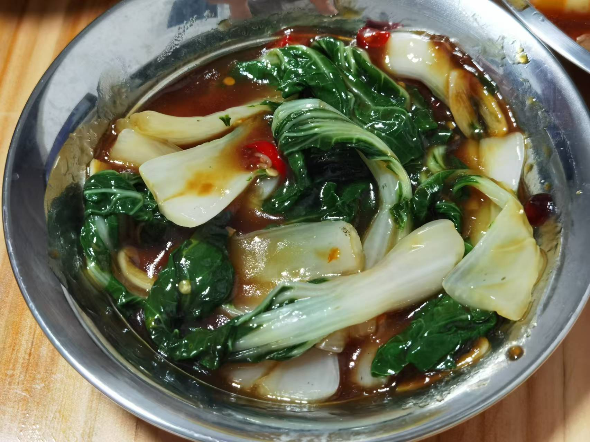
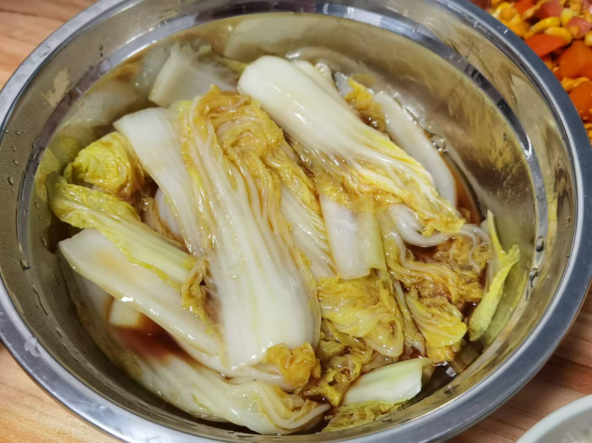

## 准备材料  
- 2棵`白菜`  
- 1瓣`蒜`  
- 1根`小米辣`  
- 调料  
    - 2勺`生抽`  
    - 1勺`蚝油`   
    - 半勺`白糖`  
    - 1勺`淀粉`  
    - 小半碗`清水`  

***********

## 步骤  
1. 白菜洗净，掰菜叶  
2. 切蒜片，小米辣切段  
3. 锅烧开水，把菜放进去烫，盛出  
    - 2~3min，筷子能轻松插进白菜梗里   
4. 油热下蒜片和辣椒，爆香   
5. 倒入调料，煮至冒泡  
    - 水少了可以加水  
6. 把料汁倒到菜上  
    - 装盘，浇汁辣白菜就完成了！  

***********

- [x] 翻拌均匀后，料汁和菜析出的水混合稀释了浓稠度！  

- [x] 没加辣椒的娃娃菜  
