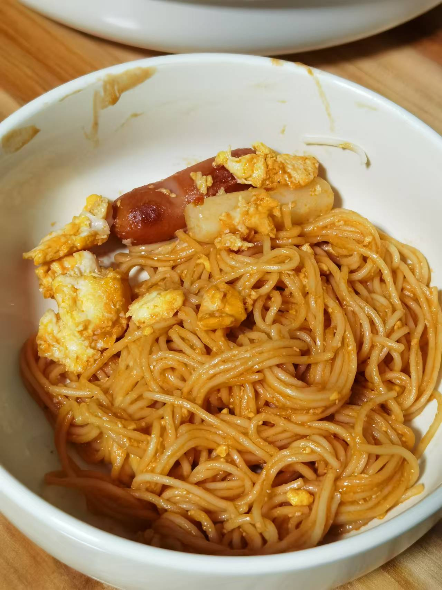
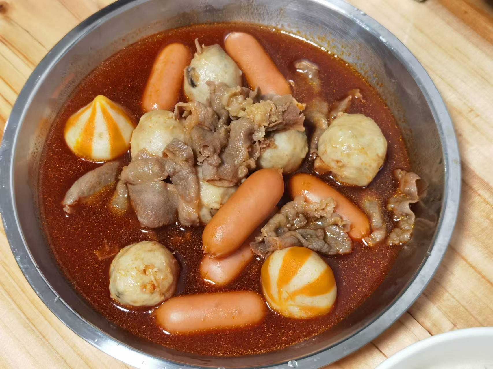
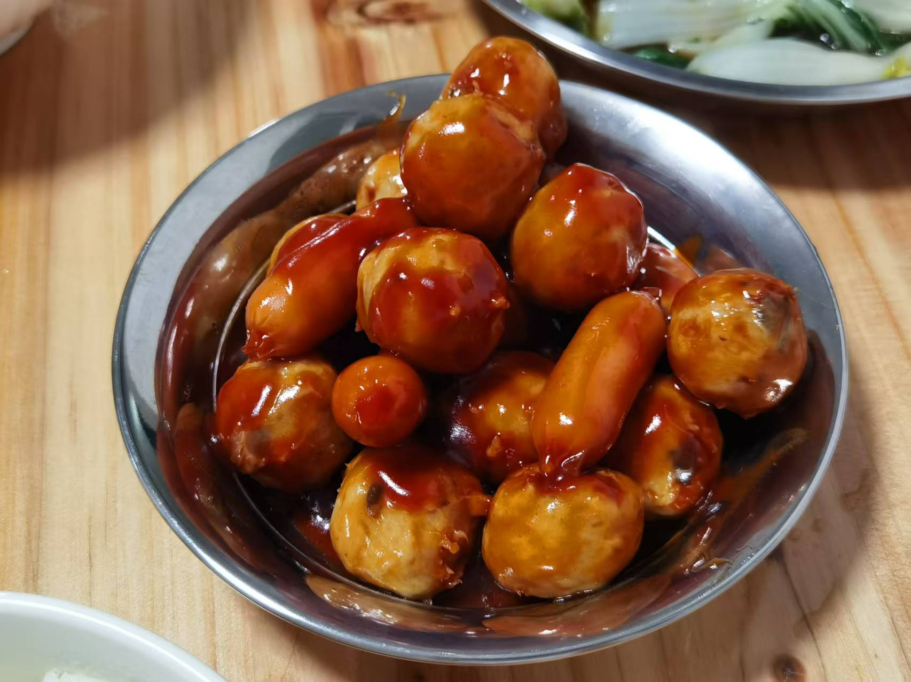

## 准备材料   
- 适量`年糕`   
- 调料  
     - 6勺`番茄酱`  
     - 1勺`蚝油`  
     - 2勺`辣椒面`  
     - 2勺`生抽`  
     - 2勺`白糖`  
     - 适量`水`  
     - 少许`盐` 

***********

## 步骤  
1. 年糕稍微洗洗  
2. 锅中放水煮开  
3. 放入年糕，煮2~3min,煮软捞出  
    - 中间不断翻动，防止粘锅  
5. 煮调料至冒泡泡，加入年糕，搅拌均匀1~2min  
    - 年糕不要煮烂了  
    - 可根据喜好加入其他配料，如`鸡蛋`、`芝士`、`面条`、`香肠`、`蟹柳`、`生菜`、`娃娃菜`等，摇身一变，变成一道年糕部队锅！  
    - 这样炒年糕就制作完成啦！ 

***********

- [x] 加了面！把料汁都吸光了啊啊啊啊  

- [x] 2024.11.28更新，调料水加多了，丸子上裹不上酱汁，但是肥牛味道刚刚好，可以专门煮肥牛吃，另外这个肥牛好好吃啊啊啊啊  

- [x] 2024.11.29更新，水放少了一点，酱汁浓郁啊  
