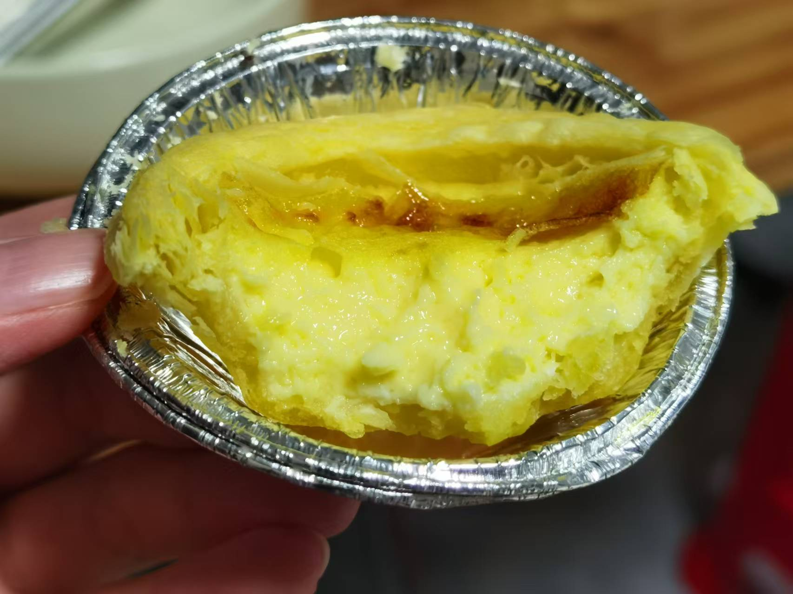

## 准备材料  
- 1个`鸡蛋`   
- 50ml`牛奶`  
- 10g`白糖` 
- 4个`蛋挞皮`  

***********

## 步骤  
1. 将鸡蛋打成蛋液  
2. 加入牛奶和白糖，拌匀  
3. 将混合好的蛋挞液倒入蛋挞皮中  
    - 蛋挞皮无需解冻  
    - 蛋挞液八分满即可，不然会在烤制时溢出来  
4. 将蛋挞放入空气炸锅烤180℃ 10min  
    - 等待烤制结束，美味的蛋挞就出锅啦！  

***********

- [x] 好吃啊~哇~~  
