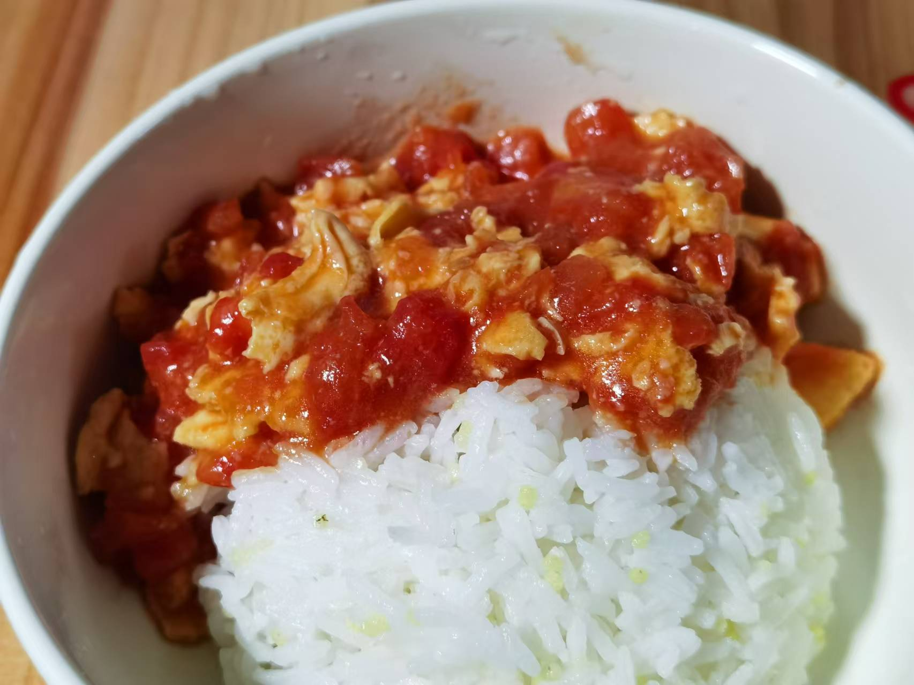
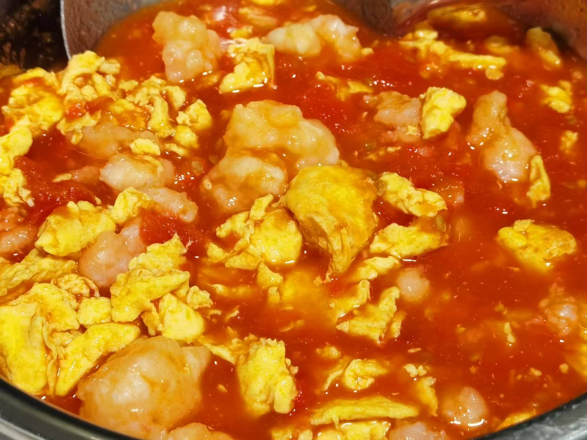

## 准备材料  
- 1个`番茄`  
- 2个`鸡蛋`  

-加蚝油咸口版！  
- 调料  
    - 1勺`生抽`  
    - 2勺`番茄酱`  
    - 半勺`蚝油`  
    - 少许`白糖`  

-加糖甜口版！  
- 调料  
    - 1勺`生抽`  
    - 2勺`番茄酱`  
    - 2勺`白糖`  
    - 少许`盐`  

***********

## 步骤  
1. 打鸡蛋液  
2. 番茄洗净去皮切丁  
3. 油热下蛋液，小火扒拉，炒至成型盛出   
4. 倒入番茄，小火炒至出汁，加调料  
5. 倒入鸡蛋，翻炒均匀  
    - 浇到蛋液上，番茄炒鸡蛋就完成了！  

***********

- [x] 番茄炒鸡蛋盖浇饭！  

- [x] 番茄虾滑鸡蛋！ 
- 提前解冻虾滑，烧开水后，挤入虾滑，煮好后捞出备用  
- 最后和鸡蛋一起放回锅中翻炒即可！ 
