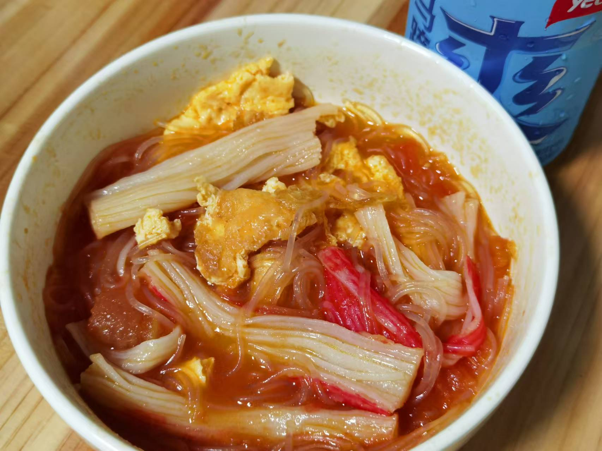

## 准备材料
- 1捆`粉丝`  
- 1个`番茄`  
- 适量`番茄酱`  
- 1碗`清水`  
- 调料  
     - 1勺`生抽`  
     - 1勺`蚝油`  
     - 半勺`白糖`  
     - 适量`盐`  

- 可根据喜好加入其他配料，如`虾滑`、`肥牛`、`油豆腐`、`香肠`、`丸子`、`蟹柳`、`生菜`、`娃娃菜`等，摇身一变，变成一道番茄超级丰盛粉丝煲！  
    - 肥牛需要提前焯水，焯水时加一勺`料酒`  
    - 冷冻的食材需要提前解冻

***********

## 步骤  
1. 烧一锅水   
    - 给番茄去皮用   
2. 准备一碗水把粉丝泡好  
    - 时不时摸一下粉丝，不要泡过头了   
    - 泡好后，把多余的水倒掉  
3. 将番茄洗净去皮切丁  
4. 油热下番茄炒出汁  
5. 放入番茄酱和清水，翻炒片刻  
6. 放入食材  
    - 如果有别的食材的话  
7. 倒入调料  
8. 放入泡好的粉丝  
9. 等粉丝煮熟  
    - 番茄粉丝煲就完成了！  

***********

- [x] 加入炒鸡蛋和蟹柳！  

- [x] 加入别的超级多食材~

