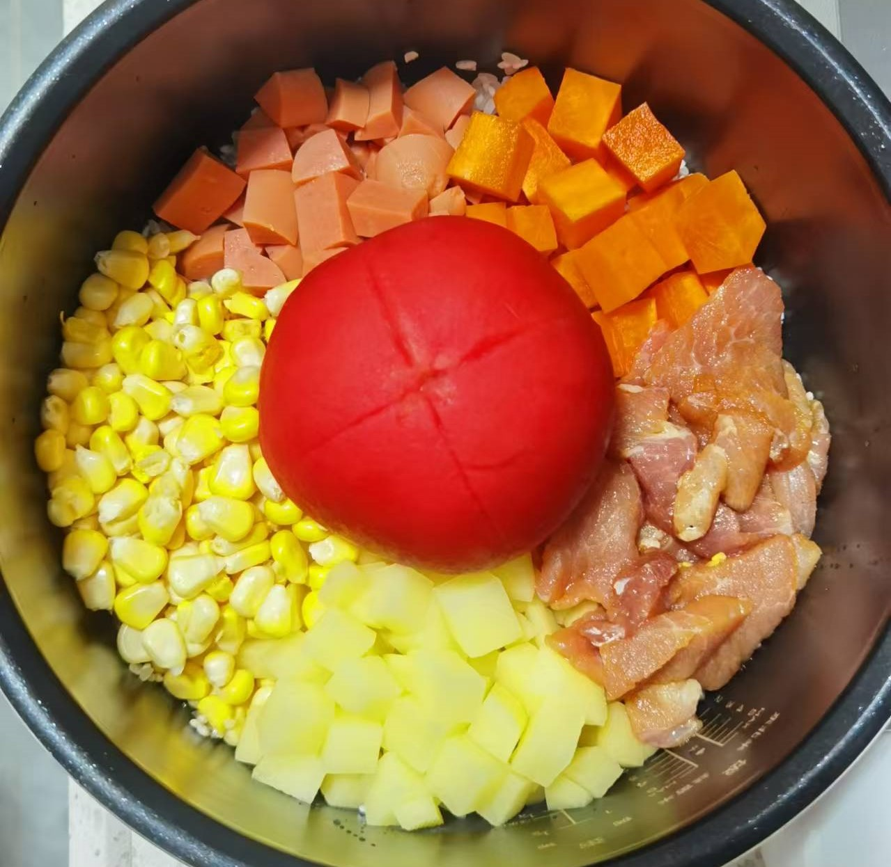

## 准备材料  
- 1个`番茄`  
- 半根`胡萝卜`  
- 1个小`土豆`  
- 1块`鸡胸肉`  
    - 或者 1块`猪肉`  
- 2根`火腿肠`  
- 半根`玉米`  
- 1杯`米`  
- 调料  
    - 1勺`油`  
    - 2勺半`生抽`  
    - 1勺`蚝油`  
    - 少许`白糖`  
    - 少许`盐`  
- 不是一杯米的话，调料适当增加  

> - 简单版：使用适量`速冻时蔬`  
>     - 不用解冻  

***********

## 步骤  
1. 把番茄洗净去顶，划十字，去皮  
2. 其余食材都洗净切丁  
3. 米洗净，放所有食材，番茄放最中间   
4. 加入基本没过食材丁的水量，倒入调料  
5. 电饭煲开慢煮模式  
    - 等待，番茄焖饭就完成了！  

***********

- [x] 番茄焖饭前！  

- [x] 简单版焖饭！没有番茄版！  

- [x] 番茄焖饭！没有滤镜哈哈哈，不抗打  

- [x] 番茄焖饭！最新制作！  
