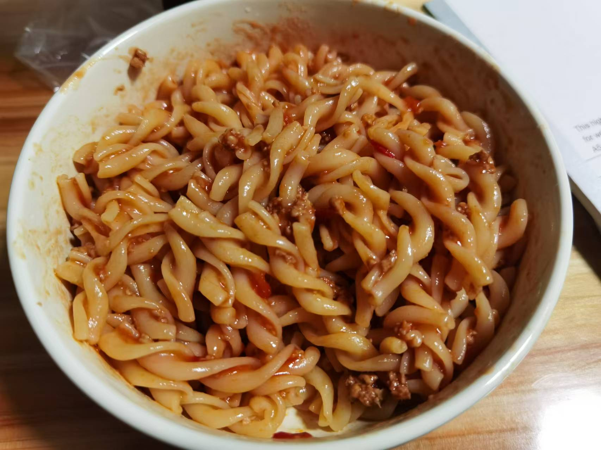

## 准备材料
- 适量`意面`  
- 1个`番茄`  
- 适量`猪肉`  
- 调料  
    - 2勺`生抽`  
    - 半勺`老抽`  
    - 1勺`蚝油`  
    - 半勺`白糖`  
    - 少许`盐`  
    - 1少`淀粉`  
    - 1小碗`清水` 
- 适量`番茄酱`  

***********

## 步骤  
1. 烧一锅水   
    - 番茄去皮用   
2. 将番茄洗净去皮切丁  
3. 将肉切成丁或者肉末  
4. 烧水煮意面，煮好之后沥水  
5. 油热下肉，炒至变色  
6. 放番茄压炒出沙  
7. 倒入调料，煮至粘稠  
8. 将肉酱倒在意面上，搅拌均匀  
    - 番茄肉酱意粉就完成了！  

***********

- [x] 搅拌搅拌~  

- [x] 搅拌搅拌~

