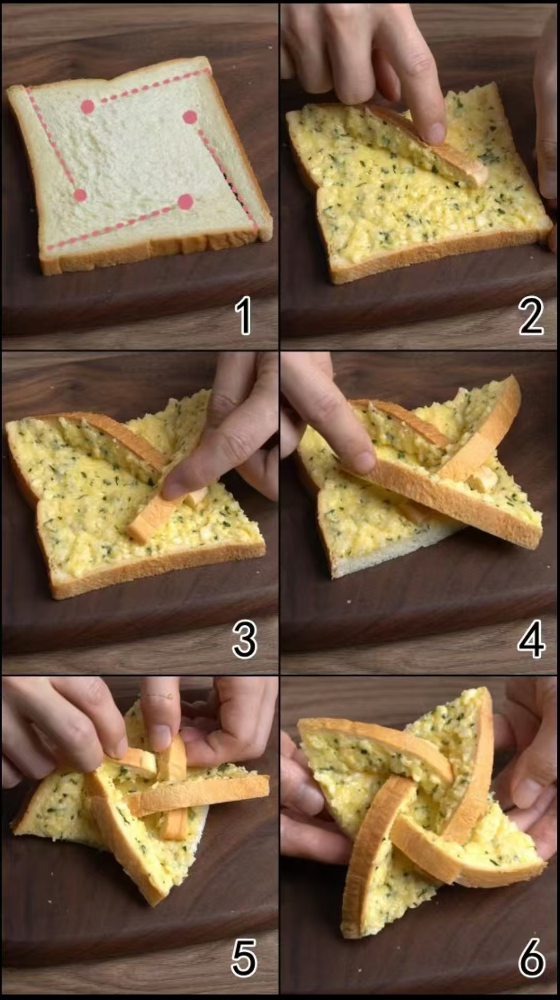

## 准备材料  
- 3片`方包`   
- 3片`芝士`  
- 20g`黄油` 
- 2g`盐`  
- 15g`蒜`  
    - 可适量减少一点  
- 适量`欧芹碎`或`葱花`  

***********

## 步骤  
1. 将芝士片、黄油融化  
2. 切蒜末  
    - 尽量碎一点  
3. 把蒜末、盐和芝士黄油搅拌到一起  
    - 有欧芹碎或葱花的话也加进来
4. 方包四边按一定的角度剪开
    - 不要剪太长  
    - 下附教程图
5. 面包片上抹上酱
6. 面包边小心摆好造型
4. 将面包放入空气炸锅烤180℃ 6min  
    - 等待烤制结束，美味的风车面包就出锅啦！  

***********

- [x] 附教程图  
