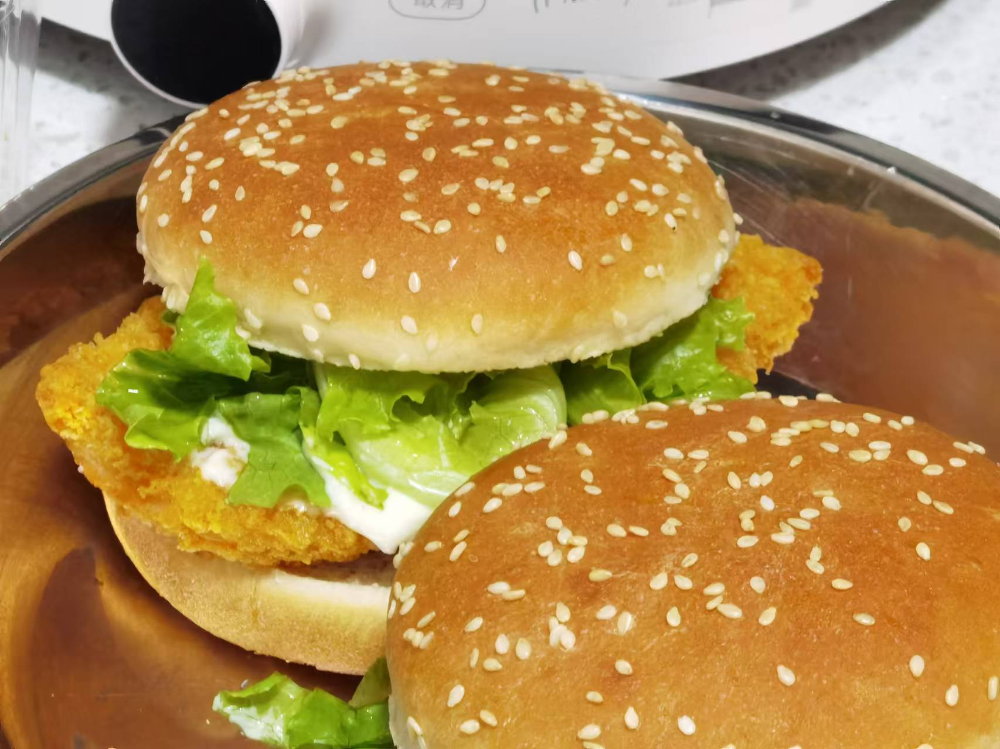
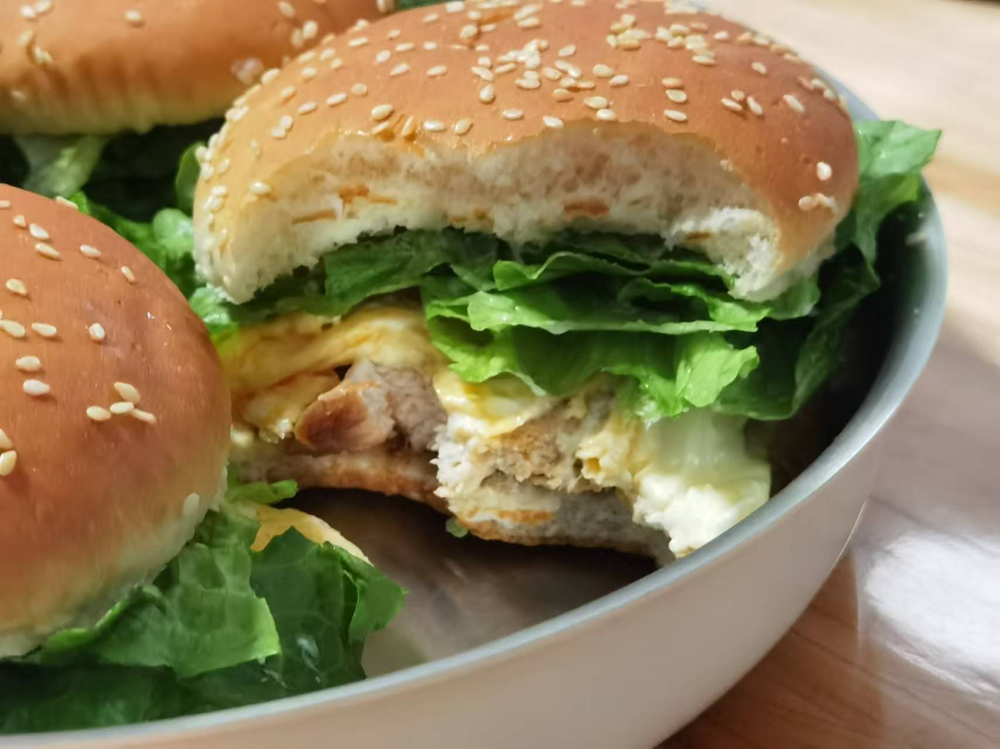

## 准备材料  
- 3个`汉堡胚`  
- 1包`圣农炸鸡胸肉`  
- 适量`生菜`  
- 调料  
    - 适量`沙拉酱`  
    - 适量`蛋黄酱`  

***********

## 步骤  
1. 把炸鸡胸肉放到空气炸锅里烤  
    - 190℃ 12min  
    - 烤完拿出来装盘  
2. 生菜洗净，切丝沥干水备用  
3. 汉堡胚放到空气炸锅里烤   
    - 180℃ 1min  
4. 汉堡胚底-鸡胸肉排-生菜-沙拉酱+蛋黄酱-汉堡胚顶  
    - 有需要可以包锡纸，汉堡包就完成了！  

***********

- [x] 特写！好看！  

- [x] 特写特写！好吃好吃！  

- [x] 特写特写特写！加上锡纸真的和外面做的一模一样！  

- [x] 之前做的，鸡排是腌来烤的，教程在烤鸡腿篇  
