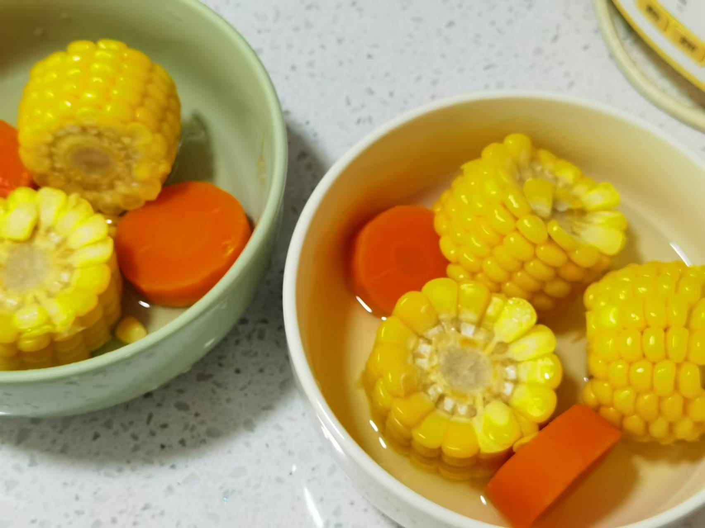

## 准备材料  
- 1根`胡萝卜`  
- 1根`玉米`  
- 适量`排骨`  
- 适量`马蹄`  
    - 也可以不放马蹄  
- 3片`生姜`  
- 1勺`料酒`  

***********

## 步骤  
1. 胡萝卜洗净削皮，切块  
2. 玉米剥皮洗净，切块  
    - 极简版到这一步就可以烧水煮了，煮25min左右就可以  
3. 马蹄洗净削皮  
4. 排骨洗净，切姜片  
5. 排骨冷水下锅，加料酒，放姜片  
    - 煮开撇去浮沫  
    - 焯水3~5min，捞出洗净备用  
6. 烧水，把所有食材放下去  
    - 大火煮开转小火，不够水就加  
    - 煮30~55min  
    - 胡萝卜玉米汤就完成了！  

***********

- [x] 极简版！没啥味道..  
