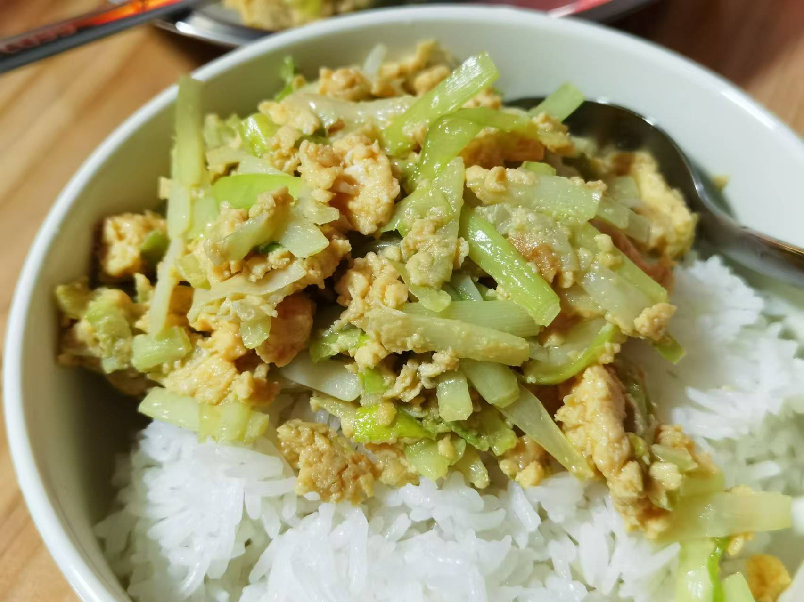

## 准备材料  
- 一把`韭黄`  
- 两个`鸡蛋`  
- 调料  
    - 一勺`生抽`  
    - 一勺`蚝油`   

***********

## 步骤  
1. 韭黄切段  
2. 打鸡蛋液   
    - 加适量`盐`  
3. 油热下韭黄，炒软，盛出备用  
4. 油热倒蛋液，翻炒  
5. 加入炒软的韭黄，翻炒片刻  
6. 加入调料，翻拌均匀  
    - 盛出，装盘，韭黄炒鸡蛋就完成了！  
