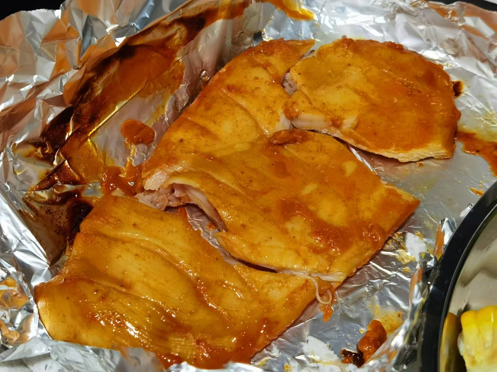

## 准备材料  
- 2个`鸡腿`  
- 调料  
    - 1勺`生抽`  
    - 1勺`蚝油`  
    - 1勺`料酒`   
    - 3勺`奥尔良腌料`  
    - 半勺`老抽`  
    - 少许`白糖`  
    - 少许`盐`  
    - 适量`柠檬蜂蜜`  

***********

## 步骤  
1. 鸡腿洗净两面花刀，吸干表面水分  
2. 调料混合，放入鸡腿   
    - 腌制数小时  
3. 空气炸锅180℃ 25-30min  
    - 等待，装盘，烤鸡腿就完成了！  

***********

- [x] 食材也可以换成鸡胸肉！  
