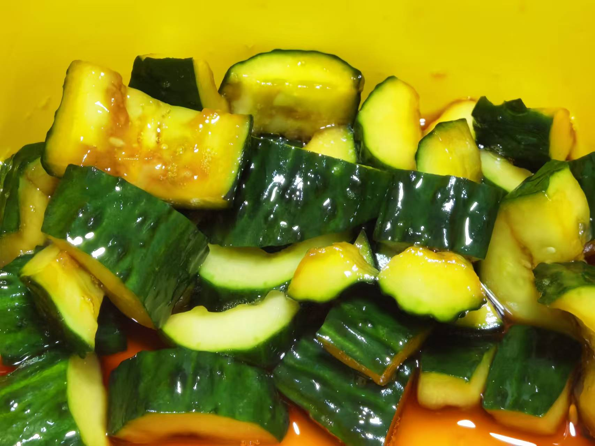
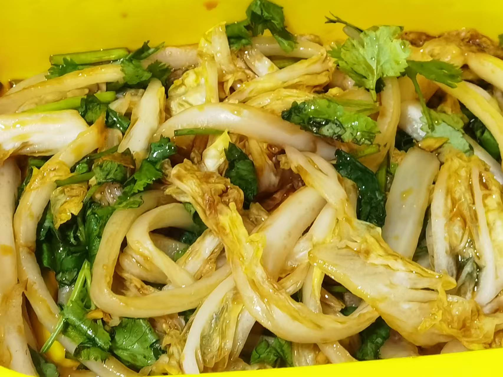

## 准备材料  
- 任一食材
- 1根`黄瓜`  
- 1颗`娃娃菜`  
- 1个`莲藕`  

- 底料  
- 1瓣`蒜`  
    - 切碎或磨成蒜泥  
- 1根`小米辣`  
    - 或者1勺`辣椒面`  
- 适量`熟白芝麻`  
- 适量`香菜`  
- 调料  
    - 2勺`生抽`  
    - 2勺`陈醋`  
    - 1勺`蚝油`  
    - 少许`白糖`  
    - 少许`盐`  

***********

## 步骤  
> 黄瓜  
1. 黄瓜洗净，刀背刮刺  
2. 砧板上拍黄瓜，去头去尾切成小段  
3. 处理好底料，浇上热油   
4. 倒入调料  
5. 放入黄瓜腌制  
    - 可以加入花生  
    - 等待，凉拌黄瓜就完成了！  

> 娃娃菜  
1. 娃娃菜洗净，切长条  
2. 放盐，杀水  
3. 腌出水分后，挤干  
4. 处理好底料，浇上热油   
5. 倒入调料  
6. 放入娃娃菜腌制  
    - 等待，凉拌娃娃菜就完成了！  

> 莲藕  
1. 莲藕洗净削皮，切薄片片  
2. 浸泡冲洗  
3. 热水焯水2min后捞出，过凉水  
4. 处理好底料，浇上热油   
5. 倒入调料  
6. 放入莲藕片腌制  
    - 等待，凉拌莲藕就完成了！  
    
***********

- [x] 凉拌黄瓜！  

- [x] 凉拌娃娃菜！  

- [x] 凉拌莲藕！  
没图片~