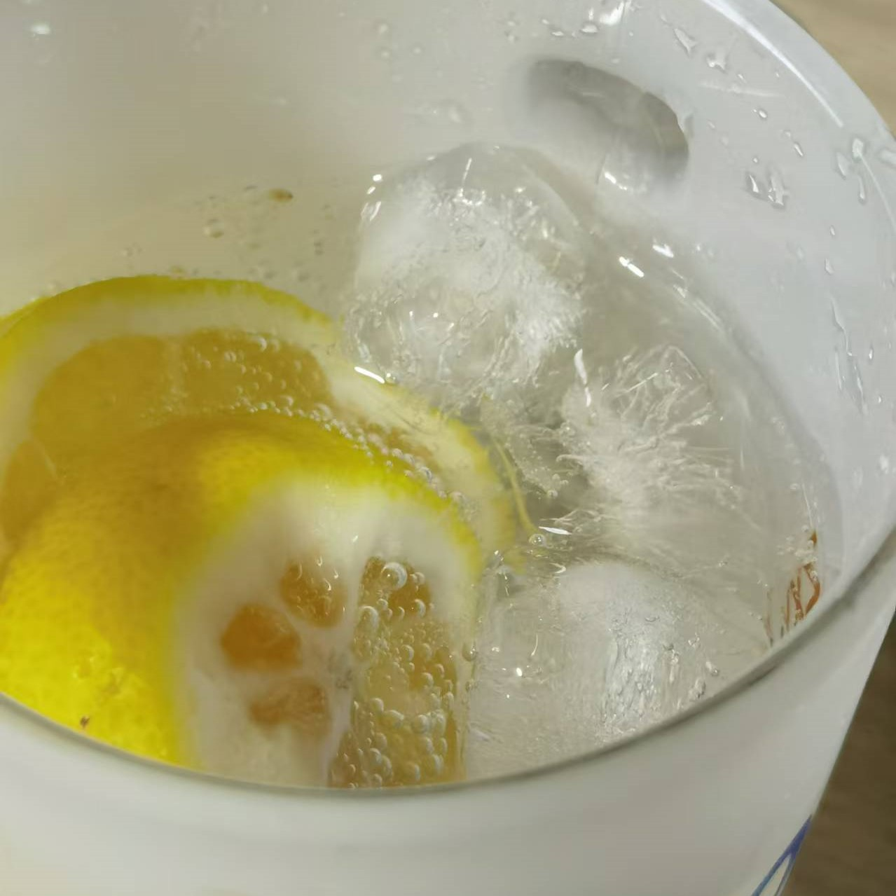

## 准备材料  
- 1个`柠檬`  
- 1瓶`气泡水`  
- 适量`冰块`  
- 适量`小青桔`  
- 适量`话梅`  

***********

## 步骤  
1. 柠檬小青桔搓盐洗净  
2. 柠檬去头去尾，切片  
3. 小青桔对半切开   
4. 杯中加入冰块，柠檬、小青桔、话梅、倒入气泡水  
    - 气泡水就完成了！  

***********

- [x] 简易气泡水  

