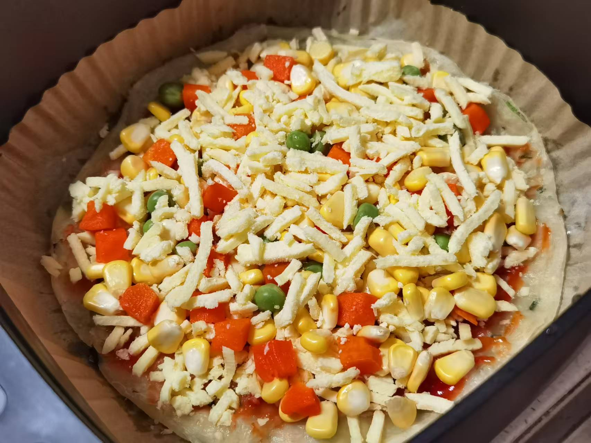
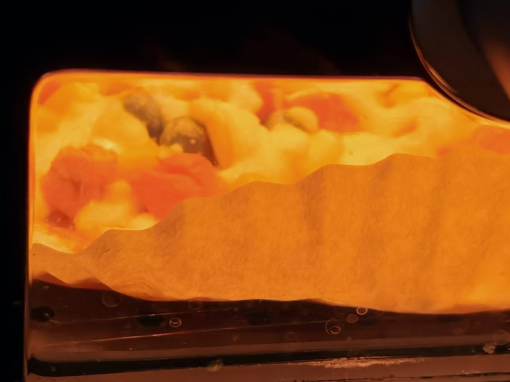
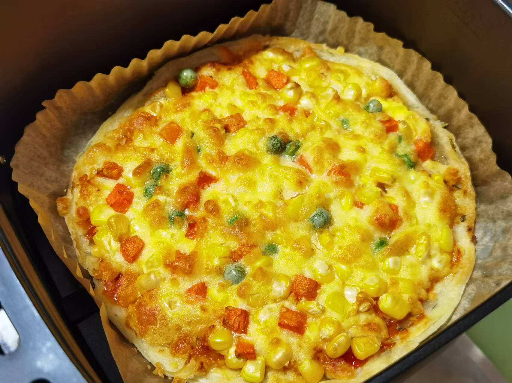

## 准备材料  
- 1张`手抓饼`  
- 1包`冷冻时蔬粒`  
- 1包`马苏里拉芝士`  
- 适量`番茄酱`  

***********

## 步骤  
1. 把手抓饼放到空气炸锅里烤  
    - 180℃ 5min不用翻面！！  
    - 烤完拿出来翻面放到新的油纸上  
2. 手抓饼上抹一层番茄酱  
3. 放上马苏里拉芝士铺底   
4. 放上时蔬粒
5. 再稍微铺一点马苏里拉芝士
6. 空气炸锅180℃ 14min 
    - 等待，时蔬披萨就完成了！

***********

- [x] 入锅！  

- [x] 烘烤中！  

- [x] 出炉！  

