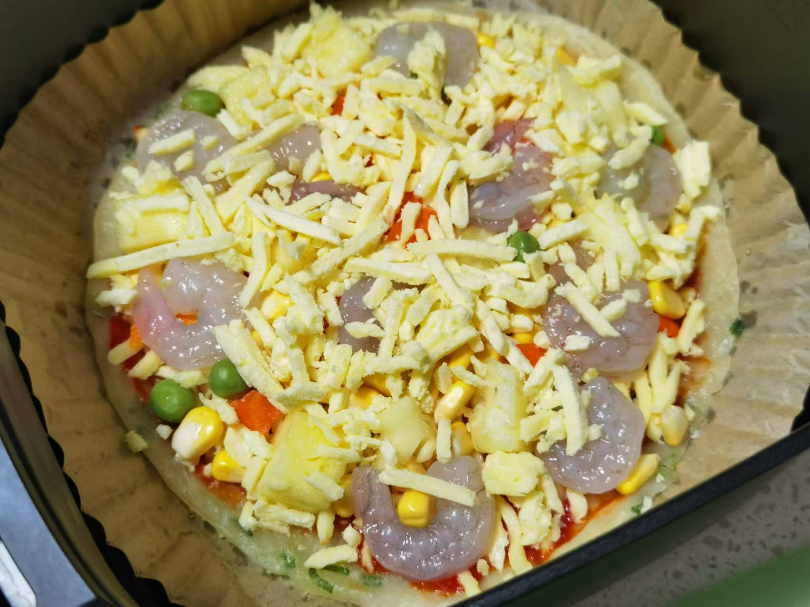
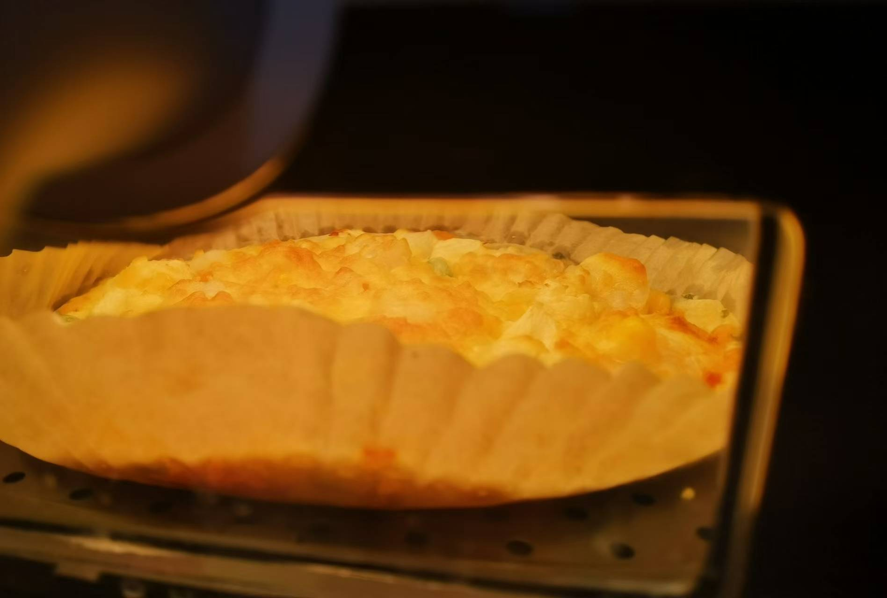
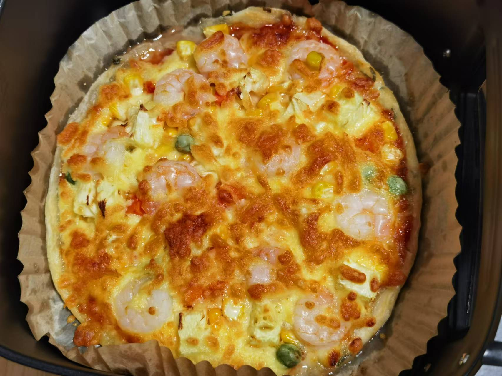

## 准备材料  
- 1张`手抓饼`  
- 1包`冷冻时蔬粒`  
- 1包`马苏里拉芝士`  
- 1/4个`菠萝`  
- 半包`冷冻虾仁`  
- 适量`番茄酱`  

***********

## 步骤  
1. 把冷冻虾仁解冻洗净  
2. 菠萝洗净切丁  
3. 把手抓饼放到空气炸锅里烤  
    - 180℃ 5min不用翻面！！  
    - 烤完拿出来翻面放到新的油纸上  
4. 手抓饼上抹一层番茄酱  
5. 放上马苏里拉芝士铺底   
6. 放上时蔬粒、菠萝丁、虾仁   
7. 再稍微铺一点马苏里拉芝士  
8. 空气炸锅180℃ 14min  
    - 等待，鲜虾菠萝披萨就完成了！  

***********

- [x] 入锅！  

- [x] 烘烤中！  

- [x] 出炉！  

