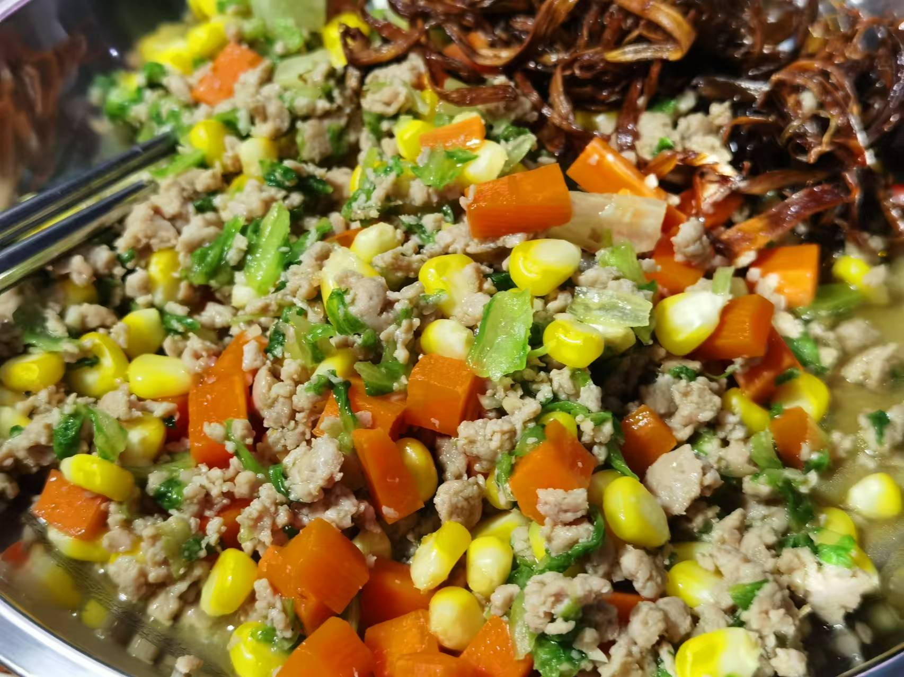

## 准备材料  
- 1块`猪肉`  
- 1小块`姜`  
- 1瓣`蒜` 
- 半根`玉米`  
- 半个`包菜`  
- 1根`胡萝卜`  
- 调料  
    - 1勺`生抽`  
    - 1勺`油`  
    - 1勺`料酒`  
    - 半勺`蚝油`  
    - 适量`盐`   
    - 适量`鸡精`  
    - 适量`胡椒粉`  
    - 1勺`淀粉`  

***********

## 步骤  
1. 把肉切成肉末，加入调料腌制  
2. 切姜末，蒜末，胡萝卜丁，包菜碎，玉米剥粒   
3. 热油爆香姜末蒜末  
4. 放肉炒变色，放1勺`蚝油`  
5. 放玉米粒、胡萝卜丁、少许`盐`，炒均匀，放包菜碎  
6. 倒入清水，没过食材，煮至汤汁浓稠  
7. 放`胡椒粉` `鸡精`翻炒均匀  
    - 盛出装盘，玉米炒肉末就完成了！  

***********

- [x] 看着卖相一般，居然有图2！  

